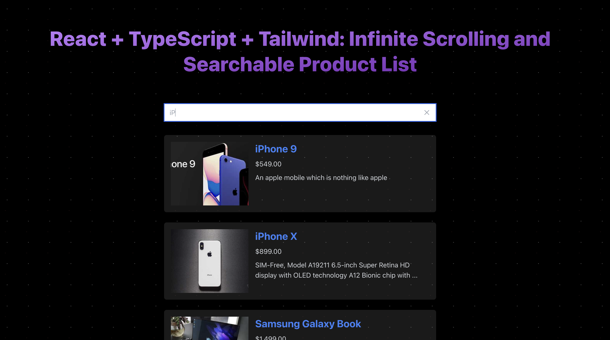

<p align='center'>
  
</p>

<h3 align='center'>
React + TypeScript + Tailwind: Infinite Scrolling and Searchable Product List<br>
</h3>

<br>

<p align='center'>

<a href="https://vital.josepvidal.dev/">Copy template from Vital @ Vite Template: </a>
<a href="https://infinite-scrolling-and-searchable-dl.netlify.app">Live Demo</a>

</p>

<br>

## Screenshot



## Features

- ⚡️ [React 18](https://beta.reactjs.org/)
- 🚀 [React Query](https://tanstack.com/query/v3/) - Caching - optimize query
- 🚀 Lazy load image
- 🚀 Request with [Fetch API](https://developer.mozilla.org/en-US/docs/Web/API/Fetch_API/Using_Fetch) (you can use [Axios](https://github.com/axios/axios/) if needed)
- 🦾 TypeScript
- 🫀 [Jest](https://jestjs.io/) - unitary testing made easy
- 🎨 [Tailwind with JIT](https://tailwindcss.com/) - next generation utility-first CSS
- 🪢 [CSS Modules](https://github.com/css-modules/css-modules)
- 👑 [Atomic Design organization](https://bradfrost.com/blog/post/atomic-web-design/)
- 🗂 [Absolute imports](https://github.com/vitejs/vite/issues/88#issuecomment-762415200)
- 😃 [Hero icons](https://heroicons.com/)
- ☁️ Deploy on Netlify, zero-config

### Coding Style

- [ESLint](https://eslint.org/) - configured for React/Hooks & TypeScript
- [Prettier](https://prettier.io/)

### Dev tools

- [TypeScript](https://www.typescriptlang.org/)
- [Commit lint](https://github.com/conventional-changelog/commitlint) - helps your team adhering to a commit convention
- [Netlify](https://www.netlify.com/) - zero-config deployment

## Try it now!

### GitHub Template

[Create a repo from this template on GitHub](https://github.com/duyenlan151/my-app).

### Getting Started

If you prefer to do it manually with the cleaner git history

```bash
step 1: clone this repo: git clone https://github.com/duyenlan151/my-app
#
step 2: cd my-app
#
step 3: npm install or yarn install #If you using yarn, If you don't have yarn installed, run: npm install -g yarn
#
step 4: npm start or yarn start #if using yarn
#
step 5: visit local site http://localhost:3000

# And, enjoy :)
```

### Environment

```bash
VITE_API_URL=
```

### Build

To build the App, run

```bash
npm run build
#or
yarn build
```

And you will see the generated file in `dist` that ready to be served.

### Deploy on Netlify

Go to [Netlify](https://app.netlify.com/start) and select your repository, `OK` along the way, and your App will be live in a minute.

### Issues

#### Husky

If pre-commit hooks are not working be sure that you have installed husky: `husky install`.

By default this command should be triggered after yarn/npm deps are installed.
